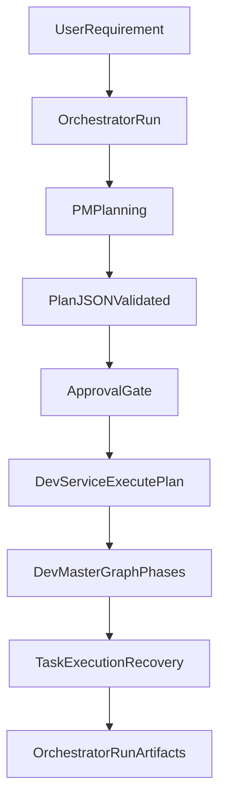

# AI Orchestrator Architecture Deep Dive

## 1) System Purpose And Operating Model

`ai-orchestrator` turns a natural-language requirement into an executable, validated implementation workflow.

The system uses two distinct roles:

- **PM role**: gather requirement context, ask clarification questions when needed, and produce a validated plan contract (`PlanJSON`).
- **Dev role**: consume the plan contract, execute a deterministic multi-phase workflow, run commands safely inside scope, recover from failures, and emit run artifacts.

This separation is intentional:

- PM logic optimizes for **decision quality and contract shape**.
- Dev logic optimizes for **execution reliability, retries, and traceability**.

---

## 2) Top-Level Architecture

Core layers:

1. **CLI Orchestration Layer**
   - `orchestrator.py`
   - Owns run modes, user gates (approval/clarification), and PM -> Dev handoff orchestration.

2. **PM Planning Layer**
   - `services/pm/pm_service.py`
   - Produces a strict plan contract and persists PM context/handoff.

3. **Dev Execution Layer**
   - `services/dev/dev_service.py`
   - Wraps the graph runtime and persists execution artifacts.

4. **Dev Workflow Graph Layer**
   - `services/dev/dev_master_graph.py`
   - Defines phase sequencing and state transitions.

5. **Task Runner / Command Execution Layer**
   - `services/dev/dev_executor.py`
   - Executes shell tasks with scope checks, retries, prompt handling, telemetry, and recovery hooks.

6. **Workspace Discovery + Shared Contracts**
   - `services/workspace/project_index.py`
   - `shared/schemas.py`, `shared/dev_schemas.py`, `services/dev/types/dev_graph_state.py`

---

## 3) Runtime Boundaries And Safety Envelope

### Execution scope

- Command execution is constrained to the orchestrator `projects/` scope.
- Path normalization and scope enforcement are applied before run (`_resolve_cwd`, `_assert_within_scope`, shared path utilities).

### Persistent state

- PM context and handoff state are persisted in `.orchestrator/`:
  - `.orchestrator/pm_context.json`
  - `.orchestrator/dev_handoff.json` and YAML companion
- Dev run artifacts are persisted under:
  - `.orchestrator/runs/<request_id>/events.jsonl`
  - `.orchestrator/runs/<request_id>/task_outcomes.json`
  - `.orchestrator/runs/<request_id>/summary.json`

### Guardrails

- Constraint blocking (example: no `git push` if constrained).
- Risk token detection for potentially dangerous commands.
- Runtime prompt detection with safe fallback behavior.
- Secret redaction in emitted logs/events for key token/password patterns.

---

## 4) End-To-End Request Lifecycle

## 4.1 Entry And Mode Routing

`orchestrator.py` supports:

- `--mode full`: PM planning + approval + Dev execution.
- `--mode plan`: PM planning only.
- `--mode execute --from-latest`: execute latest persisted plan/handoff.

In `full` mode, the flow is:

1. Requirement ingest.
2. PM phase (`create_plan`).
3. Plan print + approval gate.
4. Dev phase (`DevService.execute_plan`).
5. Status + logs summary output.

## 4.2 Existing Project Routing Heuristic

Before PM call, vague "improve/refactor/fix" requests can trigger candidate resolution (`services/pm/project_resolver.py`):

- Requirement is tokenized and scored against existing `projects/*` folders.
- Similarity + marker bonuses produce ranked candidates.
- User can confirm top candidate, which preselects `project_ref`.

## 4.3 PM Clarification And Plan Finalization

`services/pm/pm_service.py::create_plan()` orchestrates:

1. Workspace context scan (`scan_workspace_context`).
2. Checklist inference from raw requirement text.
3. LLM decision loop (up to `max_rounds=3`):
   - returns `needs_clarification` or `final_plan`.
4. Plan normalization:
   - path canonicalization under `projects/`
   - bootstrap command normalization
   - minimal target bootstrap defaults where needed
5. Contract validation via `validate_plan_json`.
6. PM context persistence + dev handoff construction.

## 4.4 Handoff Construction

`services/pm/dev_handoff_store.py::build_dev_handoff()` derives:

- normalized `project_root` and `selected_project_root`
- `structure_plan` derived from target paths
- normalized `execution_steps` from bootstrap commands
- PM checklist, constraints, validation list, clarifications
- workspace snapshot and hash
- initialized execution memory/checklist/checkpoints
- command policy defaults and generation metadata

This handoff is the bridge contract from PM intent into Dev execution.

## 4.5 Dev Graph Execution

`services/dev/dev_service.py::execute_plan()` invokes `DevMasterGraph.run()` with:

- `plan`
- optional `handoff`
- user clarification callback
- LLM correction callback
- model call budget
- log sink for live streaming

Final state is transformed into:

- status (`completed`, `failed`, etc.)
- merged logs/errors (`build_logs`)
- persisted artifacts and updated handoff status

---

## 5) Dev Graph Internals (Phase Machine)

`services/dev/dev_master_graph.py` compiles a linear LangGraph with these nodes:

1. `ingest_pm_plan`
2. `derive_dev_todos`
3. `dev_preflight_planning`
4. `ask_cli_clarifications_if_needed`
5. `prepare_execution_steps`
6. `execute_bootstrap_phase`
7. `execute_implementation_phase`
8. `execute_validation_phase`
9. `execute_final_compile_gate`
10. `finalize_result`

### Why this order matters

- **Ingest before todo derivation**: ensures plan/handoff state is canonical before task expansion.
- **Preflight before execution**: establishes project root, stack signals, and practical execution plan.
- **Clarifications before command runs**: avoids expensive wrong-path execution.
- **Validation before final compile gate**: catches targeted checks early and reserves final gate for "release confidence."

### State model

`DevGraphState` tracks:

- workflow identity (`request_id`, `current_step`, `phase_status`)
- task collections (`bootstrap_tasks`, `validation_tasks`, etc.)
- operational data (`logs`, `errors`, `attempt_history`, `task_outcomes`)
- execution governance (`llm_call_budget`, `llm_calls_used`, retry controls)
- progress controls (`internal_checklist`, `checklist_cursor`)
- discovery and evidence (`detected_stacks`, `telemetry_events`, root resolution evidence)

---

## 6) Data Contracts

## 6.1 `PlanJSON` Contract

Defined and validated in `shared/schemas.py`.

Important characteristics:

- strict top-level allowed/required keys
- nested key validation for `project_ref`, `stack`, command and target file arrays
- new project path rules: expected paths must be rooted under `projects/`
- optional sections supported for richer PM guidance:
  - `product_contract`
  - `ambiguities`
  - `technical_preferences`
  - `review_guidelines`
  - `discovery_hints`

## 6.2 Dev Task And Checklist Schemas

`shared/dev_schemas.py` provides:

- `DevTask` (id, description, command, cwd, kind)
- `DevChecklistItem` with dependencies/success criteria/evidence
- execution-state support objects used by graph and executor

## 6.3 Pipeline Envelope

`shared/state.py::PipelineState` provides high-level run envelope data used by orchestrator:

- request metadata
- selected plan
- dev status/log summary
- branch/pr placeholders

---

## 7) Command Execution And Recovery

`services/dev/dev_executor.py` is the reliability core for command runs.

## 7.1 Command lifecycle per task

For each `DevTask`:

1. validate command presence
2. enforce constraints and risk policy
3. resolve safe `cwd` under scope
4. normalize command for stack/non-interactive behavior
5. execute with retry policy
6. emit task outcome with evidence

## 7.2 Retry strategy

- Deterministic retries first (`rewrite_command_deterministic`) within budget.
- Optional final LLM-reserved attempt path (`pending_llm_task`) when deterministic rewrites exhaust.
- Failures are categorized (`interactive_prompt`, `command_not_found`, `path_issue`, etc.) and used to drive rewrite decisions.

## 7.3 Runtime process behavior

`_run_once` supports:

- streaming stdout/stderr with heartbeat
- prompt detection and callback forwarding (`y`/`n` normalized)
- timeout handling and structured attempt metadata
- "service smoke" mode that terminates successfully on readiness signal

## 7.4 Telemetry and evidence

Each attempt/outcome generates event payloads with:

- strategy and attempt index
- command previews
- exit/failure category
- elapsed timing and run mode
- stdout/stderr previews (sanitized)

This enables post-run diagnostics without re-running commands.

---

## 8) Workspace Discovery And Context Injection

`services/workspace/project_index.py` provides lightweight discovery:

- scans `projects/` and captures markers/key dirs/top entries
- infers stacks via marker maps (node/python/dotnet/rust/etc.)
- samples workspace files (bounded by limit) and builds extension histogram
- ranks candidate files by requirement token overlap

PM and Dev phases use this context to avoid blind generation and to bias planning toward existing code reality.

---

## 9) Pathing And Canonicalization

`shared/pathing.py` standardizes path behavior:

- slash normalization and prefix cleanup
- collapse nested `projects/.../projects/...` mistakes
- canonical enforcement of `projects/` rooted paths where required
- helper checks for scope membership

Why this matters:

- prevents accidental path drift in generated plans
- reduces cross-platform path edge cases
- keeps execution and artifact references coherent

---

## 10) Configuration And Model Dependencies

`config.py` constructs `AzureOpenAI` client from environment:

- required: `AZURE_OPENAI_KEY`
- optional with defaults: endpoint, API version, deployment

PM and Dev correction code checks for Responses API availability and fails with explicit guidance when SDK/runtime is incompatible.

---

## 11) Compatibility Layer Conventions

Repository contains top-level compatibility shims that re-export canonical package modules, for example:

- `services/pm_service.py` -> `services.pm.pm_service`
- `services/dev_service.py` -> `services.dev.dev_service`
- `services/dev_executor.py` -> `services.dev.dev_executor`
- `services/dev_master_graph.py` -> `services.dev.dev_master_graph`

Documentation and new code should reference canonical package paths (`services/pm/...`, `services/dev/...`), while recognizing shims exist for backward compatibility.

---

## 12) Operational Playbook

## 12.1 Typical run patterns

- Plan only:
  - `python orchestrator.py --mode plan --requirement "<text>"`
- Full run:
  - `python orchestrator.py --mode full --requirement "<text>"`
- Resume latest execution:
  - `python orchestrator.py --mode execute --from-latest`

## 12.2 Where to inspect when debugging

1. CLI output for phase boundary markers.
2. `.orchestrator/pm_context.json` for PM rounds/hypothesis/final plan.
3. `.orchestrator/dev_handoff.json` for PM -> Dev contract.
4. `.orchestrator/runs/<request_id>/summary.json` for terminal status.
5. `events.jsonl` and `task_outcomes.json` for attempt-level evidence.

## 12.3 Common failure classes

- **Contract validation failures**: inspect `shared/schemas.py` constraints.
- **Scope/path failures**: inspect cwd normalization and `projects/` rooting.
- **Command availability mismatch**: see failure category and deterministic rewrite path.
- **Interactive command issues**: inspect prompt detection logs and runtime callback handling.

---

## 13) Extension Points For Contributors

Safe extension surfaces:

1. **PM contract expansion**
   - add optional contract fields + validator updates in `shared/schemas.py`
2. **Dev graph phase behavior**
   - evolve phase modules in `services/dev/phases/` and wire through graph
3. **Command policy/risk model**
   - update token sets and risk confirmations in `services/dev/command_policy.py`
4. **Stack detection heuristics**
   - expand marker maps in `services/workspace/project_index.py`
5. **Retry/recovery strategy**
   - tune deterministic rewrite and LLM reserve behavior in `dev_executor.py`

Guidance:

- preserve backward compatibility at contract boundaries
- keep new behavior observable through telemetry and run artifacts
- ensure scope/safety invariants stay intact

---

## 14) Test Coverage Areas (By Responsibility)

Current tests cover key architecture surfaces (see `tests/`):

- PM contract and mandatory question behavior
- PM context and handoff persistence
- dev executor reliability and command policy
- pathing/scope behavior
- stack detection and compile/validation gate logic
- dev master graph and preflight planning

When extending behavior, add tests in the corresponding responsibility area rather than broad integration-only changes.

---

## 15) High-Level Architecture Diagram

---

## 16) Glossary

- **PlanJSON**: PM-authored structured execution contract validated before Dev execution.
- **Handoff**: persisted PM -> Dev package with execution steps, constraints, context snapshot, and checklist state.
- **DevGraphState**: mutable state envelope carried across all Dev graph phases.
- **Deterministic rewrite**: rule-based command rewrite based on failure category and stack hints.
- **LLM correction**: optional final rewrite pathway used after deterministic retries are exhausted.
- **Final compile gate**: last confidence checkpoint after validation tasks.
- **Checklist cursor**: marker for progress through internal execution checklist items.
- **Scope root**: command execution boundary (the `projects/` directory tree).

---

## 17) New Landscape (Path-Safe Enhancements)

This section reflects the current architecture after the path-safety implementation pass.

### 17.1 Contract-level file creation policy

PM plans now support per-target creation intent:

- `creation_policy: must_exist`
- `creation_policy: create_if_missing`

Where this is enforced:

- `shared/schemas.py` validates allowed values under each `target_files[]` entry.
- `services/pm/pm_service.py` normalizes policy defaults:
  - update-like tasks default to `must_exist`
  - create-like tasks default to `create_if_missing`

Why this matters:

- prevents unintentional duplicate file creation
- makes "modify existing file" behavior explicit and machine-checkable

### 17.2 Per-handoff repository re-index

During bootstrap/handoff execution, the Dev graph now performs re-index snapshots after each handoff command:

- emits `post_handoff_index_refresh` telemetry events
- refreshes active root evidence before moving to next step

This is implemented in `services/dev/dev_master_graph.py`.

Why this matters:

- the agent no longer relies on stale pre-scaffold assumptions
- each subsequent handoff sees the newest repository shape

### 17.3 Implementation-phase active root index

During implementation, the Dev graph now builds/refreshes an active-root file index:

- emits `implementation_index_refresh`
- tracks file basenames and suffix candidates for path resolution
- attempts deterministic path recovery before hard failure

Why this matters:

- reduces blind target guesses
- increases probability of finding existing files under nested structures

### 17.4 Mutation-proof and edit-quality hardening

The implementation phase now includes stronger safety semantics:

- mutation proof keyed by stable implementation checklist id (not shared path hint)
- verify-style targets treated as non-mutating checks
- low-signal/no-op style updates are rejected
- dotfiles are treated as files (for example, `.gitignore`)

Why this matters:

- avoids false checklist failures from cross-target hash collisions
- prevents "comment-only" style edits from being counted as success

### 17.5 Additional runtime diagnostics

Validation flow now extracts file references from compiler/runtime output and emits them as telemetry for targeted follow-up:

- `validation_error_file_refs`

This improves forensic debugging and future correction loops without re-running the entire pipeline.

---

## 18) Known Gaps Toward Cursor-Like Behavior

The orchestrator is now stronger on execution reliability and path safety, but still missing a full repository cognition layer.

### 18.1 What is strong today

- planning and contract enforcement
- scoped/safe command execution
- retries, logging, and run artifacts
- incremental path-awareness improvements

### 18.2 What is still missing

1. **Repository cognitive model**
   - no persistent symbol/import/dependency graph
   - no architecture-aware targeting (routes, entrypoints, config topology)
2. **Structured editing engine**
   - implementation remains mostly full-content generation per file
   - no symbol/region-level edit primitives with AST-aware guards
3. **Persistent repository memory**
   - limited carry-forward of "what was learned" across editing micro-steps
4. **Iterative locate-modify-validate micro-loop**
   - current graph remains phase-linear at a high level
5. **Intent-based capability routing**
   - execution path is still dominant; doc/analysis generation is not first-class
6. **Artifact reasoning breadth**
   - code execution is stronger than non-code artifact generation governance
7. **Semantic diff self-evaluation**
   - no robust "did this edit satisfy intent?" scorer before accepting change

---

## 19) Postmortem: `time-app` Run (`dad281de-c182-4778-88d8-66b3f028b76f`)

### 19.1 What worked

- scaffold succeeded (`npm create vite@latest ... react-ts`)
- dependency install succeeded
- dev server smoke validation succeeded
- runtime index refresh events were emitted and captured

### 19.2 What failed

- implementation failed with:
  - `Expected target missing and discovery failed: projects/time-app/src/index.tsx`
- checklist items `todo_impl_1..todo_impl_9` then failed as a cascade

### 19.3 Evidence from artifacts

- indexed files contained `src/main.tsx`
- indexed files did not contain `src/index.tsx`
- root cause was path target mismatch in plan/targets vs scaffold reality

### 19.4 Root cause class

**Entry-file alias mismatch** between framework/scaffold conventions and PM target assumptions.

For Vite React templates:

- expected entrypoint is often `src/main.tsx`
- not `src/index.tsx`

### 19.5 Near-term mitigations

1. add entrypoint alias mapping in implementation resolution (`index.*` <-> `main.*` where stack markers support it)
2. improve plan-time target normalization using scaffold-aware file existence checks after bootstrap
3. before checklist mutation phase, run a target existence reconciliation pass and rewrite ambiguous targets to discovered canonical files
4. classify this failure as recoverable context gap first, not terminal implementation failure

### 19.6 Why this postmortem matters

This run demonstrates the current state well:

- execution and telemetry are strong
- path cognition is improved
- but repository cognition is not yet deep enough to auto-resolve scaffold-specific semantic aliases consistently
