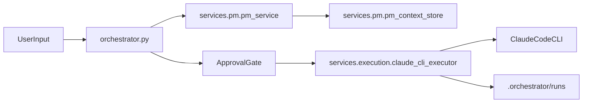

# Architecture Deep Dive

## Runtime Topology

## PM Layer

`services/pm/pm_service.py` is responsible for:

- clarification loop and dynamic questioning,
- plan normalization,
- plan schema validation,
- persistence of final plan in PM context store.

PM does not emit executable command lists as operational truth; execution strategy is delegated to the CLI executor.

## Execution Layer

`services/execution/claude_cli_executor.py` is responsible for:

- converting plan contract into a Claude prompt,
- invoking the CLI via `subprocess`,
- streaming runtime output back to orchestrator,
- enforcing timeout and exit-code behavior,
- writing run artifacts.

## Data Contracts

- Input contract: PM plan dictionary.
- Output contract: execution result object with `status`, `build_logs`, and `final_summary`.
- Artifact contract: `.orchestrator/runs/<request_id>/summary.json` and `cli_output.log`.

## Design Constraints

- No dependency on removed `services/dev` runtime.
- Keep orchestrator thin; no business logic duplication.
- Prefer explicit contracts and deterministic artifact outputs.

