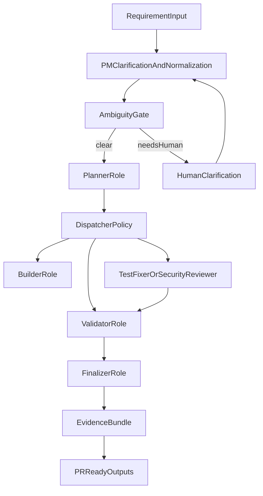

# Architecture Overview

## Target Outcome

The system accepts requirements and runs an end-to-PR autonomous pipeline with least-privilege tool usage, deterministic stage transitions, and immutable evidence.

## Layered Design

1. Core orchestration (`orchestrator.py`, `shared/state.py`)
   - Stack-agnostic state transitions and control flow.
2. Role services (`services/pm`, `services/execution`)
   - PM clarification/normalization and OpenHands-first implementation runtime.
3. Contract layer (`shared/*.py`)
   - Plan, stage, role policy, event, and artifact validators.
4. Deterministics packs (`deterministics/`)
   - Stack-specific commands, gates, prompts, and repo hints.

## Stage Graph

## Runtime Invariants

- Every stage emits an immutable event with `request_id` and `correlation_id`.
- Every decision stores provenance (`reason`, `inputs`, `policy_rule`, `outcome`).
- Core runtime does not embed React/Nest/Mongo logic.
- Stack-specific behavior is loaded from a deterministic pack.

## Failure Budgets And Resume

- Per-stage retry budget is policy driven.
- Escalation occurs on exhausted budget or policy-denied action.
- Resume entrypoint uses persisted state and replays deterministic stage ordering.
