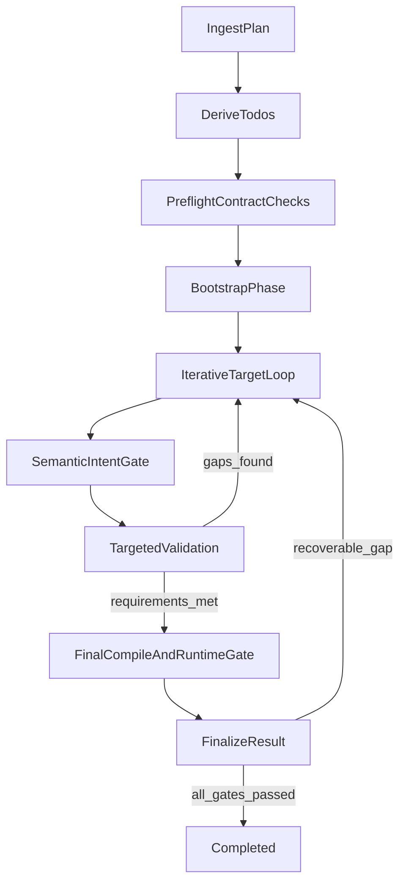

# AI Orchestrator Next Steps (Reliability-First Cursor-Like Roadmap)

## Purpose

This document is the implementation roadmap for evolving `ai-orchestrator` into a reliable, architecture-aware, Cursor-like dev system.

Primary intent of this revision:

- prioritize Dev reliability and architectural correctness over external integrations,
- remove false positives where tasks are marked complete only because a command exited successfully,
- shift from a mostly linear graph to a bounded iterative micro-loop machine,
- enforce `ARCHITECTURE_AND_CODING_GUIDELINES.md` as a hard gate for milestone completion.

---

## North Star And Non-Negotiables

### Definition of done for Dev execution

A task is complete only when all are true:

1. semantic intent is satisfied (not only syntax changed),
2. target application compiles/builds/runs correctly for its stack,
3. requirement-level acceptance checks pass,
4. evidence is persisted in run artifacts.

### Non-negotiables from architecture guidelines

- Hard split trigger: no file should remain above 500 lines.
- Soft split trigger: files above 300 lines require decomposition plan.
- Monolithic orchestration that mixes unrelated concerns is banned.
- Cross-layer coupling leaks are banned (for example, Dev importing PM persistence internals).
- Completion must include post-edit intent checks, not only command outcomes.

### Senior-like Strategy Selection and Skepticism (Non-negotiable)

- Strategy selection rubric must be explicit per task: `canonicality`, `reproducibility`, `validation speed`, and `requirement fit`.
- Execution discipline is `claim -> verify -> revise`: every implementation claim must be validated by tool-produced evidence, then revised when evidence disagrees.
- The graph enforces skepticism by design: the model proposes hypotheses and plans; tools provide truth and gate progression.
- Repeated failed hypotheses must be recorded and must force strategy revision instead of retrying the same approach.

---

## Current Reality Check (A-D Revalidation)

Status key: `Implemented` | `Partial` | `Not started`

### Milestone A: Repository Cognition Index

- Status: `Implemented` (baseline) + hardening pending.
- Current strengths:
  - cognition package exists under `services/workspace/cognition/`,
  - PM->Dev handoff includes `cognition_snapshot`,
  - runtime index refresh and candidate resolution are present.
- Remaining deficits:
  - deeper AST/LSP precision across long-tail stacks,
  - stronger delta indexing for very large repositories,
  - broader fixture calibration and confidence tuning.

### Milestone B: Structured Editing Engine

- Status: `Partial`.
- Current strengths:
  - edit primitives + pre/post validators exist (`services/dev/edit_primitives.py`, `services/dev/edit_validator.py`).
- Remaining deficits:
  - residual string-replacement behavior,
  - wrong-target mutation risk in difficult paths,
  - insufficient deterministic second-pass correction quality.

### Milestone C: Persistent Repository Memory

- Status: `Partial`.
- Current strengths:
  - memory model exists in graph state and is merged/trimmed.
- Remaining deficits:
  - repeated failed hypotheses still occur across passes,
  - memory is not yet a decisive driver for retry quality.

### Milestone D: Locate -> Modify -> Validate Micro-Loop

- Status: `Not started` as complete architecture, `Partial` as building blocks.
- Current strengths:
  - target-level checks and validations exist in implementation execution.
- Remaining deficits:
  - no fully bounded per-target iterative loop with robust refine/retry,
  - linear phase machine still dominates recovery behavior,
  - completion logic still leans too heavily on command/hash outcomes.

---

## Reliability-First Milestone Order

This roadmap supersedes prior ordering.

1. **M0: Architecture compliance + monolith decomposition**
2. **M1: Iterative micro-loop engine**
3. **M2: Semantic completion gate**
4. **M3: Pre-story architecture and validation planning contract**
5. **M4: Structured editing + memory hardening**
6. **M5: External integrations (Jira/PR/chat/email)**

External integrations are intentionally lower priority until Dev reliability is consistently high.

---

## M0: Architecture Compliance And Monolith Decomposition (Highest Priority)

### Objective

Reduce architectural risk and enforce coding standards before deep behavior changes.

### Why now

- `services/dev/dev_master_graph.py` (~3500 lines) violates hard file-size rule and makes reliable loop refactors unsafe.
- `services/dev/dev_executor.py` is also oversized and mixes concerns.

### Files to touch

- `services/dev/dev_master_graph.py` (shrink to orchestration-only)
- `services/dev/dev_executor.py` (separate execution/retry/telemetry concerns)
- New extracted modules under `services/dev/` (see decomposition map below)

### Decomposition map (feasible chunks)

Extract responsibilities from `services/dev/dev_master_graph.py` into focused modules:

1. `services/dev/repository_memory.py`
2. `services/dev/checklist_manager.py`
3. `services/dev/target_resolver.py`
4. `services/dev/command_inference.py`
5. `services/dev/state_utilities.py`
6. `services/dev/error_classifier.py`
7. `services/dev/project_index_manager.py`
8. `services/dev/content_generator.py`
9. `services/dev/implementation_executor.py`
10. `services/dev/artifact_persister.py`

Target end-state:

- `services/dev/dev_master_graph.py` acts as graph wiring + orchestration shell only.
- All extracted files stay within guideline thresholds (target 120-300 lines, no >500).

### Implementation tasks

1. Extract pure utility/state methods first (low-risk moves).
2. Extract memory/checklist management next.
3. Extract target resolution and command inference.
4. Extract implementation and finalize behaviors.
5. Leave `dev_master_graph.py` with only graph topology + delegates.
6. Add/adjust tests per extracted responsibility.

### Anti-patterns to avoid

- Big-bang rewrite with no behavior-preserving checkpoints.
- Moving code without updating telemetry boundaries and contracts.
- Creating many tiny files below meaningful cohesion.

### Acceptance criteria

- No Dev file exceeds 500 lines.
- `dev_master_graph.py` reduced to orchestration focus.
- Behavior parity is preserved for baseline scenarios.
- Decomposition does not increase cross-layer coupling.

### Telemetry/quality metrics

- regression count per extraction phase,
- graph run pass/fail parity on baseline scenarios,
- static file-length compliance checks.

### Rollback strategy

- Perform extraction in small PR-sized slices with behavior parity tests.
- If parity fails, rollback that slice only, not the entire decomposition program.

---

## M1: Iterative Micro-Loop Engine (Replace Linear One-Shot Behavior)

### Objective

Replace one-shot target mutation with a bounded iterative per-target loop.

### Files to touch

- `services/dev/phases/execute_implementation_target.py`
- `services/dev/implementation_executor.py` (new from M0)
- `services/dev/dev_master_graph.py` (graph transitions/delegation)
- `services/dev/types/dev_graph_state.py`

### Required loop

Per target:

1. perform capability discovery from repository and environment (initializer/build/test scripts, runtime assumptions),
2. select strategy with rationale (scaffold vs manual and validation approach) using the rubric in North Star,
3. locate candidate set,
4. inspect/re-read localized context,
5. propose mutation,
6. apply mutation,
7. run semantic post-edit verification,
8. run targeted validation with tool-produced evidence,
9. classify failures and force strategy change when repeated failures indicate hypothesis lock-in,
10. retry with refined hypothesis only when it is materially different from prior failed attempts,
11. terminate with explicit reason (`completed`, `recoverable_blocked`, `terminal_failed`).

### Loop controls

- max iteration count per target,
- confidence thresholds,
- retry budgets and cooldown rules,
- explicit stop reasons persisted as structured artifacts.

### Acceptance criteria

- Reduced cascade failures from single wrong-target assumptions.
- Increased percentage of tasks reaching targeted validation phase.
- Recoverable mismatches re-enter loop instead of failing terminally on first miss.

---

## M2: Semantic Completion Gate (Do Not Gate On Command Success Alone)

### Objective

Make semantic correctness and requirement fulfillment first-class completion gates.

### Files to touch

- `services/dev/edit_validator.py`
- `services/dev/phases/execute_implementation_target.py`
- `services/dev/dev_master_graph.py`
- `services/dev/phases/execute_validation_phase.py`
- `services/dev/phases/finalize_result.py`

### Required behavior

Completion decision must combine:

1. semantic intent satisfied for each target,
2. compile/runtime checks pass for stack-appropriate commands,
3. requirement-specific validation criteria passed,
4. evidence captured in artifacts (`events.jsonl`, `task_outcomes.json`, summary).

Explicitly insufficient alone:

- hash delta,
- file changed status,
- shell exit code.

### Disallowed completion patterns

- UI appears correct but no network call behavior is verified.
- Files changed but no stack-appropriate build/run proof exists.
- Manual scaffolding is used when a canonical ecosystem initializer exists, without explicit justification.

### Implementation tasks

1. add semantic intent validation primitive(s) in validator layer,
2. call semantic gate after mutation and before target completion,
3. enforce final gate in finalize phase against requirement-level outcomes,
4. surface mismatch reasons and confidence in telemetry.

### Acceptance criteria

- no target marked complete when semantic gate fails,
- reduced false-positive “completed” outcomes,
- final summaries report semantic evidence, not only command logs.

---

## M3: Pre-Story Architecture And Validation Planning Contract

### Objective

Before implementation begins, force an architecture/runtime/test strategy contract per story.

### Files to touch

- `services/pm/pm_service.py`
- `services/pm/dev_handoff_store.py`
- `shared/schemas.py`
- `services/dev/phases/dev_preflight_planning.py`
- `services/dev/phases/execute_bootstrap_phase.py`

### Mandatory pre-story checklist

For every story, handoff must include:

1. **Bootstrap strategy decision record**: scaffold vs manual creation with explicit rationale and rejection notes for alternatives.
2. **Runtime assumptions**: language/runtime/toolchain versions.
3. **Secrets/config needs**: API key/env requirements and validation path.
4. **Network assumptions**: CORS, connectivity, async behavior, retries.
5. **Execution assumptions**: DOM ready timing, HTML+JS coupling, bundling/hosting implications where applicable.
6. **Validation plan by app type**:
   - API: request/response checks, status/error handling,
   - UI/web: render and interaction validation,
   - CLI/library: compile/build + representative command checks,
   - mobile: platform build/run checks.
7. **Validation evidence plan**: define which artifact(s) prove behavior is correct (logs, command output, smoke checks, test reports).
8. **External dependency risk plan**: health check or fallback behavior for APIs/CDNs/URLs, version pinning where feasible, and avoidance of fragile dependencies.
9. **Toolchain verification plan**: explicit commands the agent must run to confirm the environment supports the chosen strategy.
10. **Handoff success criteria**: objective definition of “works according to requirements.”

### Acceptance criteria

- no story enters implementation without this contract,
- validation tasks are generated from contract, not generic defaults only,
- preflight fails fast when required runtime/config assumptions are undefined.

---

## M4: Structured Editing And Memory Hardening

### Objective

Complete B/C deficits so edits become precise and retries improve meaningfully.

### Files to touch

- `services/dev/edit_primitives.py`
- `services/dev/edit_validator.py`
- `services/dev/types/dev_graph_state.py`
- `services/dev/repository_memory.py` (from M0)
- `services/dev/implementation_executor.py` (from M0)

### Implementation tasks

1. strengthen symbol/region-based operations and targeted diff validation,
2. persist and reuse rejected hypotheses across retries,
3. prevent repeated wrong-target attempts within the same run,
4. raise deterministic diagnostics that inform retry planning.

### Acceptance criteria

- near-zero no-op/comment-only accepted edits,
- measurable drop in repeated failed candidate attempts,
- higher first-pass target completion under same benchmark set.

---

## M5: External Integrations (Lower Priority, After Reliability Milestones)

### Objective

Add workflow ecosystem integrations only after M0-M4 reliability gates are stable.

### Scope

- Jira requirement ingestion + status updates,
- PR lifecycle automation (GitHub/Azure DevOps),
- notifications and question loops (Teams/Slack/email),
- completion publishing for review workflows.

### Files to touch

- `shared/integrations.py` (ports already present)
- `services/pr/pr_service.py`
- integration adapters in new infra modules
- orchestrator entrypoints for event/webhook-based runs

### Dependency rule

Do not prioritize M5 ahead of unresolved M1/M2 reliability blockers.

---

## Graph Architecture Target (From Linear To Iterative)

---

## Why the micro-loop is not enough without senior-like strategy selection

A micro-loop can still fail if it keeps iterating on the wrong strategy.
If the system starts with a weak bootstrap choice, wrong build command family, or an unverifiable validation method, repeating the loop only repeats the mistake faster.
Reliability requires explicit strategy selection before mutation begins, plus evidence gates that disallow optimistic completion.
The loop must classify failures and detect repeated hypothesis patterns, not just count retries.
When failure signatures repeat, the next step must be a strategy change, not another near-identical attempt.
Likewise, semantic checks alone are insufficient without runtime/build/test proof tied to requirements.
“Looks correct” is not acceptable without tool-generated evidence.
The target behavior is disciplined execution where proposals are cheap, verification is mandatory, and completion is earned.

---

## Milestone Template (Use For Future Updates)

Each milestone section in this document should keep this structure:

1. Objective
2. Why now
3. Files to touch
4. Implementation tasks
5. Anti-patterns to avoid
6. Acceptance criteria
7. Telemetry/metrics
8. Rollback strategy

This format is mandatory so new chats can execute without rediscovery.

---

## Near-Term Execution Sequence

1. M0 architecture compliance and decomposition
2. M1 iterative micro-loop engine
3. M2 semantic completion gate
4. M3 pre-story architecture/validation contract
5. M4 structured editing + memory hardening
6. M5 integrations

If there is a conflict in roadmap priorities, prefer reliability milestones over integration milestones.
